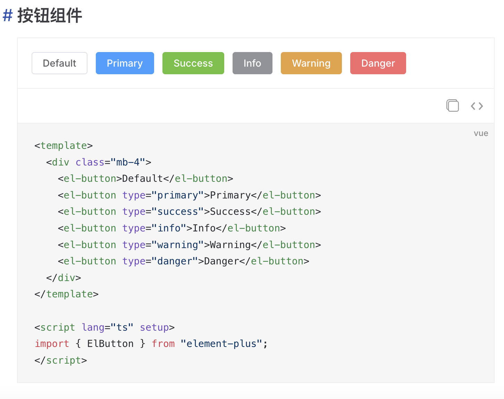

# vitepress-vue-demo

## 简介

vitepress-vue-demo 是一个基于 Vitepress 开发的插件，它可以帮助你在编写文档的时候，通过`路径引用`，直接展示 `Vue 组件示例 + 代码`。

灵感来源：[element-plus源码](https://github.com/element-plus/element-plus/tree/dev/docs)


## 安装

```
npm install -D vitepress-vue-demo
yarn add -D vitepress-vue-demo
pnpm add -D vitepress-vue-demo
```

## 使用

1、`docs/.vitepress/config.ts` 中为markdown增加扩展

```ts
// .vitepress/config.ts
import { defineConfig } from 'vitepress'
import { mdVueDemoPlugin } from 'vitepress-vue-demo'


// https://vitepress.dev/reference/site-config
export default defineConfig({
  ...
  markdown: {
    config: (md) => {
      md.use(mdVueDemoPlugin)
    }
  }
})
```

2、`docs/.vitepress/theme/index.ts` 中注册组件。

将你项目中所有vue示例组件，统一放到一个目录下，例如`docs/demos`。

然后通过vite的`import.meta.glob`模块，将这个目录下所有vue组件导入进来，传给`mdVueDemo`组件即可！

```ts
// .vitepress/theme/index.ts
import type { Theme } from 'vitepress'
import DefaultTheme from 'vitepress/theme'
import type { Component } from 'vue'
import { mdVueDemo } from 'vitepress-vue-demo'
import 'vitepress-vue-demo/dist/style.css'

const modules = import.meta.glob<Component>('../../demos/**/*', { eager: true, import: 'default' })

export default {
  extends: DefaultTheme,
  enhanceApp({ app }) {
     app.use(mdVueDemo, { modules })
  }
} satisfies Theme

```

3、在你的文档中，可以通过路径直接展示组件了！

```md

## 按钮组件

::: demo

demos/Button.vue

:::

```



## 更多用法

1、默认展开代码

```md

::: demo expand

demos/Button.vue

:::

```